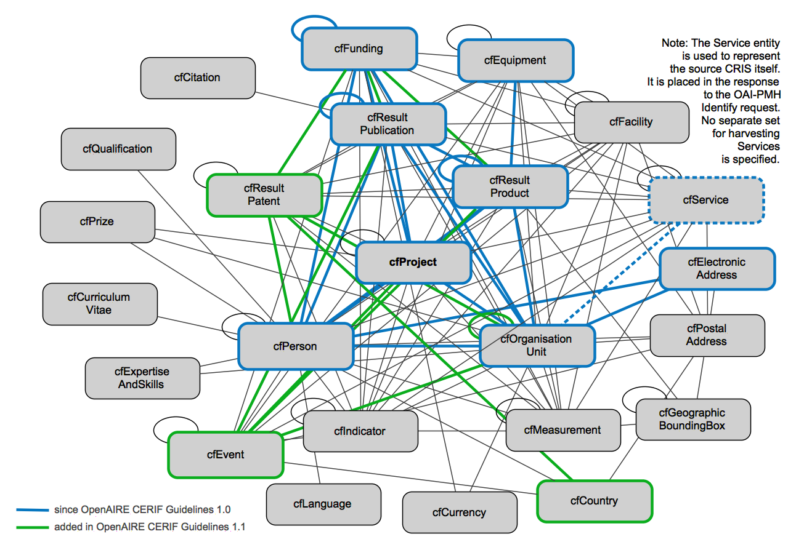

***********************************************
CRIS information elements relevant for OpenAIRE
***********************************************

CERIF is a comprehensive model for the research domain.
Only a subset of that information is relevant for OpenAIRE. 
For example, Publications, Products (including research datasets and software), and Events fall in the scope of the OpenAIRE profile,
while Prizes and Geographic bounding boxes do not.
The following diagram shows the part of the CERIF model is being used in this version of the OpenAIRE Guidelines:

The CERIF model provides for research information objects to be classified according to their type, status, subject, etc. and for expressing the types of relationships.
It does not, however, fix the semantic vocabularies to be used for such classifications; CERIF only recommends some that may have common applicability.
For information communication to be successful, any CERIF profile needs to specify the semantic vocabularies so that producers know what to produce and consumers know what to expect. 

The OpenAIRE CERIF profile does precisely this and prescribes most vocabularies to be used.
The most notable example is the fact that the types of research outputs are expressed using the COAR Resource Types vocabulary. [#]_
CERIF has three entities to represent research outputs: Publications, Products and Patents. 
The COAR vocabulary was broken down into thee separate sub-vocabularies to be used with the respective entities.

.. [#] See https://vocabularies.coar-repositories.org/resource_types/

The following sections define the CERIF data elements for the exchange of data between individual CRIS systems and the OpenAIRE infrastructure. 
The exclusive use of the defined data elements and vocabularies is mandatory, i.e. no other data elements and vocabularies can be used in the CERIF XML data exposed by CRIS systems to the OpenAIRE infrastructure.
The vocabularies are sourced from relevant external sources; the remaining vocabularies are based on the `CERIF Vocabularies <https://github.com/EuroCRIS/CERIF-Vocabularies>`_ project.

.. toctree::
   :maxdepth: 1

   cerif_xml_publication_entity
   cerif_xml_product_entity
   cerif_xml_patent_entity

   cerif_xml_person_entity
   cerif_xml_organisation_entity

   cerif_xml_project_entity
   cerif_xml_funding_entity
   
   cerif_xml_service_entity
   cerif_xml_equipment_entity
   
   cerif_xml_event_entity

   cerif_xml_medium_entity

   cerif_xml_common_parts
